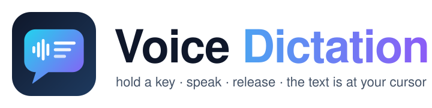
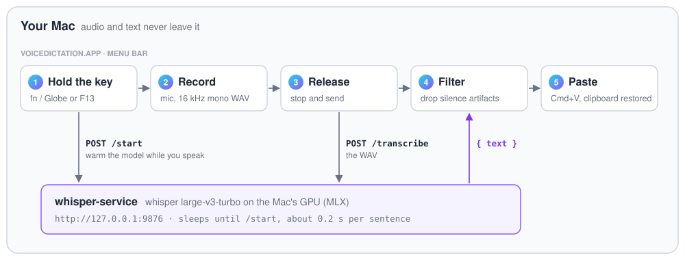

<h1 align="center">
  <picture>
    <source media="(prefers-color-scheme: dark)" srcset="docs/assets/logo-dark.svg">
    
  </picture>
</h1>

<h3 align="center">Push-to-talk dictation for macOS, transcribed by Whisper on your own Mac.</h3>

<p align="center">
  <a href="https://github.com/gapsong/mac-voice-dictation/actions/workflows/tests.yml"></a>
  
  
  
  
  
  <a href="LICENSE"></a>
</p>

<p align="center">
  <a href="#quick-start">Quick start</a> ·
  <a href="#how-it-works">How it works</a> ·
  <a href="#troubleshooting">Troubleshooting</a> ·
  <a href="docs/DESIGN.md">Design</a> ·
  <a href="#status">Status</a>
</p>

**Hold a key, speak, release** - the text appears at your cursor, in any app.
Speech is transcribed by Whisper `large-v3-turbo` on your Mac's own GPU, through the companion [whisper-service](https://github.com/gapsong/whisper-service).
It takes about 0.2 s for a sentence, works offline, and your voice never leaves the Mac.
A small native Swift menu-bar app: no Electron, no account, no cloud, no subscription.

> [!WARNING]
> **This project is 100% vibe coded.**
> Every line - Swift code, scripts, tests and this README - was written by AI coding agents (Claude Code), steered and tested by a human.
> The author uses it every day on their own Macs, but nobody has audited it line by line.
>
> The app asks for **Microphone** and **Accessibility** access.
> Accessibility lets it watch global key events (for the hotkey) and send Cmd+V to other apps (for pasting).
> That is powerful access: read the code before you grant it, if that matters to you.
>
> Use it at your own risk.
> It comes with no warranty and no promise of support (see the [MIT license](LICENSE)).
> Issues and pull requests are welcome, but answers may be slow.

---

## Why this repo exists

Many dictation apps for the Mac are paid, closed source, or send your audio to a cloud.
This one is small, free, open and local, and built around four rules:

- **Hold to talk.**
  Key down records, key up pastes.
  There is no mode to toggle and nothing to forget to switch off.
- **Whisper quality.**
  `large-v3-turbo` handles German, English and technical words well, and it runs on the Mac's GPU fast enough to feel instant.
- **Nothing leaves the Mac.**
  The app talks only to a server on `127.0.0.1`.
  No account, no telemetry.
- **Works in every app.**
  It pastes the text like you would, so it works in any text field: editors, browsers, chat apps, terminals.

The whole app is about 2,700 lines of Swift, split so that the logic is unit-tested without a screen or a microphone.

## How it works

<p align="center">
  <picture>
    <source media="(prefers-color-scheme: dark)" srcset="docs/assets/flow-dark.svg">
    
  </picture>
</p>

1. **Key down.**
   The app starts recording and, at the same moment, sends `POST /start` so the model warms up while you are still speaking.
2. **Recording.**
   A small overlay at the bottom of the screen shows a pulsing red dot.
3. **Key up.**
   The audio goes to whisper-service as a 16 kHz mono WAV.
4. **Filter.**
   On silence, Whisper likes to answer with subtitle boilerplate such as "Untertitelung des ZDF, 2020".
   The app drops those and shows "No speech detected" instead of pasting junk.
5. **Paste.**
   The text goes to the pasteboard, the app sends Cmd+V to the focused app, and then puts your previous clipboard back.

The details (state model, hotkey state machine, server contract, signing) are in [docs/DESIGN.md](docs/DESIGN.md).

## Quick start

You need a Mac with Apple Silicon (M1 or later) and the Xcode Command Line Tools (`xcode-select --install`; full Xcode is not needed).

**1. The speech server** (one time, downloads the model, about 1.6 GB):

```sh
git clone https://github.com/gapsong/whisper-service.git
whisper-service/scripts/install.sh
```

**2. The app:**

```sh
git clone https://github.com/gapsong/mac-voice-dictation.git
mac-voice-dictation/Scripts/install.sh
```

This builds the app, installs it to `/Applications/VoiceDictation.app` and starts it.

**3. One-time macOS settings** (the install script lists them too):

- Allow the microphone when macOS asks.
- System Settings > Privacy & Security > **Accessibility**: turn on **VoiceDictation** (for the hotkey and for pasting).
- System Settings > Keyboard > "Press Globe key to": **Do Nothing**.

Now click into any text field, **hold fn/Globe**, speak, and release.
On an external keyboard, use **F13** instead - see [Hotkeys on external keyboards](#hotkeys-on-external-keyboards).

To update later: `git pull` in both folders and run both install scripts again.

## Usage

The app lives in the menu bar only (no Dock icon).
The icon shows the state: idle, recording, transcribing, inserting, error, or a missing permission.

From the menu you can:

- choose the **hotkeys** (several can be armed at once),
- choose the **language**: Auto-detect (the default), German, or English,
- set the **server URL**, if your Whisper server runs somewhere else,
- turn on **Launch at Login**,
- run **Check Server**, which shows whether the model is `sleeping` or `ready`,
- open the **status window**.

The status window shows the live status, both permissions (with Grant buttons), the server check, and all the settings.
If the menu-bar icon is hidden (for example behind the notch on a MacBook), open the app again from Finder or with `open /Applications/VoiceDictation.app`: the running app then shows this window.

Settings are kept across restarts and updates.

## Hotkeys on external keyboards

**fn on a third-party keyboard does not reach macOS at all.**
Apple's fn/Globe key is special: it travels on a private Apple channel.
Other keyboards handle their fn key inside their own firmware and send nothing to the Mac, so no app can see it.

That is why the app also arms **F13** by default:

1. In your keyboard's own configurator (NuPhy Console, VIA, QMK, Logi Options+, …), remap a key you do not otherwise use - its fn, Right Control, or a spare macro key - to **F13**.
2. That is it. F13 is already armed, so holding the remapped key starts dictation.

F13-F19 work well because Apple keyboards do not have them and macOS binds nothing to them.
They are also plain keys: holding one does not change what your other keys type, unlike Right Option, which types `@`, `€` and `|` on a German layout.
F14-F19 and the modifier keys are selectable in the **Hotkeys** menu too.

## Permissions

The app needs two macOS permissions.
The menu shows a ⚠ item for each one that is missing.

1. **Microphone**, to record.
   macOS asks on the first start.
2. **Accessibility**, for the global hotkey and for the synthetic Cmd+V.
   macOS does not ask for this one.
   Turn it on in **System Settings > Privacy & Security > Accessibility**.
   The menu item "Grant Accessibility access" opens that page, and the app arms the hotkey as soon as access is granted.

The build signs the app with a stable local identity, so macOS keeps these grants when you update.

**Free up the Globe key.**
By default, macOS uses fn/Globe for the emoji picker or to switch input sources, which would fire every time you dictate.
Set **System Settings > Keyboard > "Press Globe key to" > "Do Nothing"**.
If you would rather keep that, turn fn off in the **Hotkeys** menu and use another key.

## What it deliberately is NOT

- **Not a cloud service.**
  There is no hosted backend and no account.
  You can point it at another server with the same API, but nothing does that by default.
- **Not live transcription.**
  The text appears after you release the key, not word by word while you speak.
- **Not an AI writing tool.**
  It pastes what you said.
  It does not rewrite, summarize or reformat.
- **Not a signed download.**
  There is no notarized `.dmg`.
  You build the app from source with one script, and it is signed with a local self-signed identity.

## Troubleshooting

| What you see | What to do |
|---|---|
| "Server unreachable (whisper-service running?)" | Check `curl http://127.0.0.1:9876/health`. If it fails, run `whisper-service/scripts/install.sh` again. |
| The hotkey does nothing | Check that Accessibility is on for VoiceDictation. On an external keyboard, use F13 (see above). |
| The emoji picker opens when you press fn | Set "Press Globe key to" to "Do Nothing" (see [Permissions](#permissions)). |
| "No speech detected" | Whisper heard only silence. Check that the right microphone is the input in System Settings > Sound, then speak while you hold the key. |
| The text is in the wrong language | Auto-detect can guess wrong on very short phrases. Choose your language in the **Language** menu. |
| macOS asks for permissions again after an update | The build fell back to ad-hoc signing. Its output says why; see [Stable code signing](docs/DESIGN.md#stable-code-signing). |

To see the app's log, quit it and run it in the foreground:

```sh
/Applications/VoiceDictation.app/Contents/MacOS/VoiceDictation
```

To see what happens to every key press (useful when a key does nothing):

```sh
VOICEDICTATION_LOG_HOTKEYS=1 /Applications/VoiceDictation.app/Contents/MacOS/VoiceDictation
```

```
[hotkey] keyDown(keyCode: 105) flags=0x20800000 device=0x0 -> began
[hotkey] keyUp(keyCode: 105) flags=0x20800000 device=0x0 -> ended
[hotkey] keyDown(keyCode: 51) flags=0x100 device=0x100007c5b -> ignored
```

No line at all when you press the key means macOS never received it - that is the external-keyboard fn case above.

## Build from source

`Scripts/install.sh` does everything.
To only build or only test:

```sh
Scripts/build-app.sh    # swift build -c release, then assembles and signs build/VoiceDictation.app
Scripts/test.sh         # the unit tests (wraps swift test)
```

The project is a Swift Package plus a small bundling script, not an Xcode project, so it builds from the command line with only the Command Line Tools.
How the signing works, what the tests cover, and the manual end-to-end checklist are in [docs/DESIGN.md](docs/DESIGN.md).

## Status

- **Works:** daily use on the author's Macs (Apple Silicon, macOS 27), with Apple and external keyboards, in German and English.
- **Tested automatically:** the core logic (WAV encoding, the HTTP client and its retries, the hotkey state machine, the silence filter, the overlay model, settings).
  CI builds the app and runs these tests on every push.
- **Tested by hand only:** the microphone, the global hotkey, the paste and the overlay.
  macOS does not allow these to run headlessly; [docs/DESIGN.md](docs/DESIGN.md#manual-end-to-end-check) has the checklist.
- **Not supported:** Intel Macs with the default server (whisper-service needs Apple Silicon), and macOS older than 13.

## Related

- [whisper-service](https://github.com/gapsong/whisper-service): the local Whisper server this app talks to.

## License

[MIT](LICENSE).
